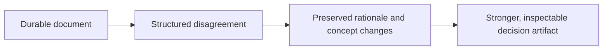
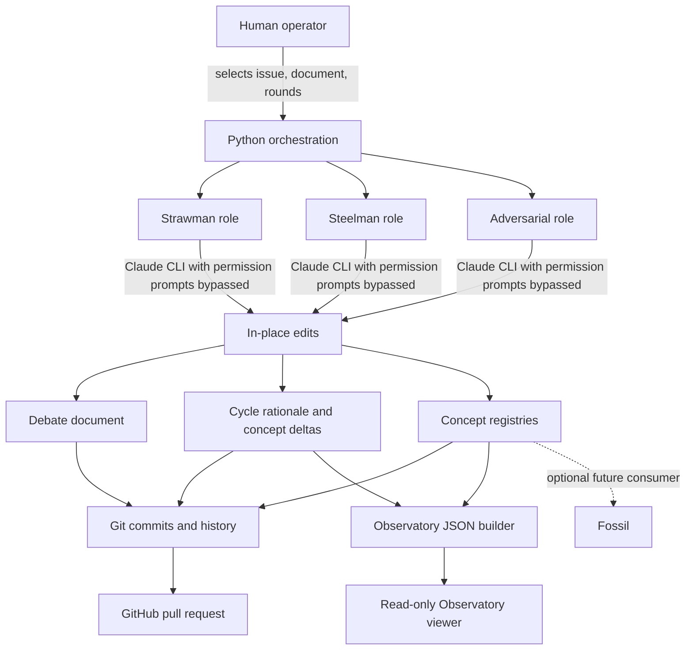

# Crucible

> Give a durable work product structured opposition—and keep the reasoning trail.

Crucible is an **early prototype** of a Git-native debate engine for design documents, strategy memos, and architecture proposals. It can produce useful artifacts, but its automated workflow gives an AI coding agent broad write access, changes Git history, and opens a pull request. Review the trust boundary below before running it.

## Why it matters



Strawman passes expand the solution space, steelman passes strengthen it, and adversarial passes probe assumptions and failure modes. The history—rationale, mutations, dead ends, and resistance—is part of the result.

## Choose your path

### Inspect the example Observatory (viewer only)

This path is read-only with respect to the repository. It serves the checked-in generated JSON; if that file cannot be loaded, the UI displays a prominent **MOCK DATA** label.

| Requirement | Why |
|---|---|
| Python 3 (or another local static server) | Serves files over HTTP |
| Network access to Google Fonts and unpkg | Loads fonts, React 18, ReactDOM, and Babel from CDNs |
| Modern browser | Runs the prototype UI |

```bash
cd visualizations
python3 -m http.server 7890
```

Open [the primary multi-view Observatory](http://localhost:7890/observatory-ui/). `Tree View.html` is retained as an explicitly classified experimental light-theme, tree-focused variant; it is useful design work, not a second canonical viewer.

Serve from `visualizations/`, not `visualizations/observatory-ui/`, so the viewer can request `../observatory.json`. There is no package install or local build step for the viewer, but it is not dependency-free: its runtime libraries are CDN-hosted.

### Run an automated debate (mutating and high trust)

The automation is experimental. There is currently **no dry-run or report-only mode**; that product work is tracked in [issue #18](https://github.com/dhk/crucible/issues/18). Use the manual path below first if you are evaluating Crucible or do not want an AI tool operating with bypassed permission prompts.

#### Prerequisites

| Requirement | Used for |
|---|---|
| Python 3.10+ and `make` | Local scripts and targets |
| Git repository with configured author identity | Branches, staging, and commits |
| Clean working tree on the intended base branch | Prevents user changes from being mixed into generated commits |
| Claude CLI installed, authenticated, and on `PATH` | Every automated agent pass |
| Claude filesystem/tool access to this checkout | Direct document, review, and registry edits |
| GitHub CLI (`gh`) installed and authenticated | Issue lookup and pull-request creation |
| GitHub read access to the source issue | `make new-debate` |
| GitHub permission to push the branch and create a PR | Completing the full workflow (push is still a separate operator step) |
| Network access | Claude and GitHub calls |

#### Current side effects

| Command | External calls | File writes | Git/GitHub effects |
|---|---|---|---|
| `make new-debate ISSUE=…` | `gh issue view` | May initialize missing registry CSVs; creates `docs/active/<slug>.md` | Runs `git checkout -b debate/<issue>-<slug>`, stages the seed document, and commits it |
| `make run-cycle …` | Runs `claude --dangerously-skip-permissions -p <prompt>` | Creates `reviews/cycles/cycle-NNN/{rationale.md,concept_delta.yaml}`, writes the full prompt to `/tmp/crucible-cycle-NNN-<mode>.md`, and instructs Claude to edit the document and registry files in place | Stages the document, cycle directory, and all of `concepts/registry/`, then commits |
| `make run-debate …` | Repeats `run-cycle` three times per round; finally runs `gh pr create` | All cycle writes above; rewrites `visualizations/observatory.json` | Creates one commit per successful pass and attempts to open a PR from the current branch to `main`; it does **not** push the branch itself |
| `make build-observatory …` | None | Writes the selected output JSON (default `visualizations/observatory.json`) | None |

`--dangerously-skip-permissions` disables Claude Code's normal permission prompts. The prompt limits requested edits to the debate document, cycle artifacts, and concept registries, but the operating-system process is not sandboxed by Crucible. Run it only in a disposable or recoverable checkout with credentials and unrelated files kept outside the agent's reach.

## Recommended trust-building path

This path lets a human inspect and approve each mutation. It does not invoke Claude automatically and does not commit or open a PR for you.

```bash
# 1. Start clean and create your own branch.
git status --short
git switch -c debate/manual-example

# 2. Initialize registries and scaffold one cycle.
make init
make new-cycle MODE=strawman DOC=docs/active/design-doc.md CYCLE=010

# 3. Review agents/strawman.md and prompts/run_pass.md, then use the model/tool
#    of your choice without bypassing its permission controls. Inspect every edit.
git diff -- docs/active/design-doc.md reviews/cycles/cycle-010 concepts/registry

# 4. Generate derived artifacts only after approving the source edits.
make extract-concepts MODE=strawman DOC=docs/active/design-doc.md CYCLE=010
make pr-body MODE=strawman CYCLE=010
make build-observatory DOC=docs/active/design-doc.md

# 5. Validate and commit explicitly.
python3 scripts/validate_registry.py
python3 scripts/build_graph.py
python3 scripts/compute_idea_health.py
git diff --check
git status --short
git add <reviewed-paths>
git commit
```

`make init` creates only missing registry files. `make new-cycle` writes both cycle files even if that cycle directory already exists, so choose a new cycle number or inspect and preserve existing files first. `make extract-concepts` appends candidate rows to `concepts/registry/concepts.csv`; review that diff before continuing. `make pr-body` writes `reviews/cycles/cycle-NNN/pr_body.md`, and `make build-observatory` rewrites the selected JSON output.

## Automated path

After reading the side-effect matrix and confirming a clean, disposable/recoverable checkout:

```bash
git status --short
make new-debate ISSUE=<url-or-number>
make run-debate DOC=docs/active/<slug>.md ROUNDS=3

# run-debate does not push; inspect first, then push deliberately
git log --oneline --decorate <base-branch>..HEAD
git diff <base-branch>...HEAD
git push -u origin "$(git branch --show-current)"
```

If any cycle fails, `run-debate` asks whether to continue. Continuing can leave incomplete cycle artifacts and may still advance the cycle counter, so stop and inspect unless you understand the failure.

## Recovery

Before a run, record `git status --short`, the current branch, and `git rev-parse HEAD`. If automation stops:

1. Do not run another cycle immediately.
2. Inspect `git status --short`, `git diff`, and `git log --oneline --decorate -10`.
3. Preserve wanted edits by committing them or copying them outside the checkout.
4. Remove unwanted untracked files individually and restore tracked files deliberately; avoid broad destructive cleanup commands.
5. If `new-debate` created a branch but failed before committing, switch back only after resolving or preserving its working-tree changes.
6. If a PR was created from an unpushed/unexpected branch state, close or correct it in GitHub after confirming the intended commits.

## Architecture and trust boundary



The roles are prompt definitions, not isolated security principals. Crucible asks Claude to edit a bounded list of files, but the CLI flag bypasses interactive permission checks; Git and GitHub are the durable audit and collaboration layers.

## Fossil: implemented vs intended

Implemented today:

- debate documents carry a `fossil_export: true` metadata hint;
- PR templates contain a Fossil export checklist/notes section;
- registry CSVs, cycle metadata, and Observatory JSON provide potential lineage inputs.

Not implemented in this repository:

- no Fossil client, API call, exporter, synchronization job, or compatibility test;
- no automatic ingestion into a Fossil instance;
- no guarantee that the current schemas match a Fossil release.

Fossil is therefore an **intended optional consumer**, not a working integration.

## Status and repository map

This is a research/prototyping repository: schemas, prompts, scripts, and viewers can change; security hardening, packaging, and stable compatibility guarantees are not yet present. See [docs/README.md](docs/README.md) for the documentation index, [CONTRIBUTING.md](CONTRIBUTING.md) for validation and change guidance, and [SECURITY.md](SECURITY.md) for the security policy.

Key directories are `agents/` (roles), `scripts/` (automation), `docs/active/` (work products), `reviews/cycles/` (per-pass records), `concepts/registry/` (structured lineage), and `visualizations/` (generated data and prototype viewers).

## License

See [LICENSE](LICENSE).
